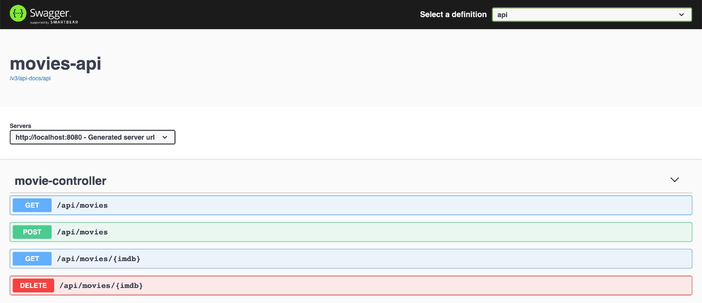
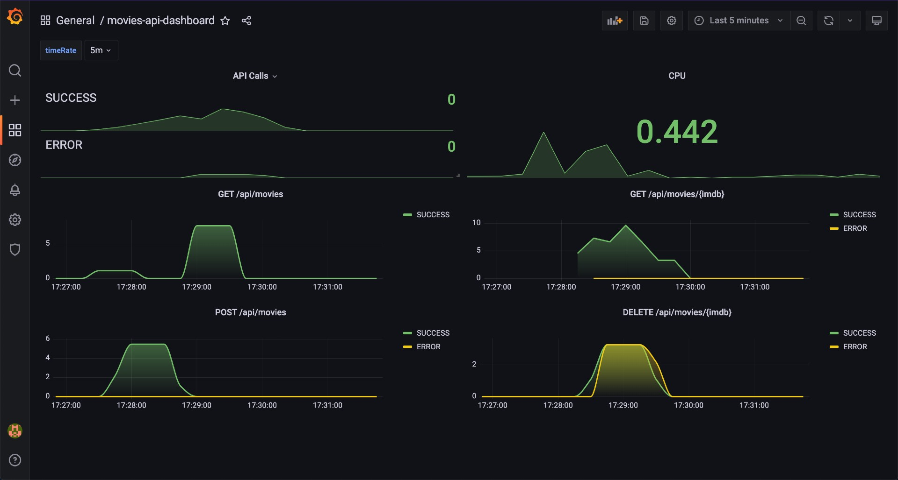

# springboot-elk-prometheus-grafana

The goal of this project is to implement a [`Spring Boot`](https://docs.spring.io/spring-boot/docs/current/reference/htmlsingle/) application, called `movies-api`, and use [`Filebeat`](https://www.elastic.co/beats/filebeat) & `ELK Stack` ([`Elasticsearch`](https://www.elastic.co/elasticsearch), [`Logstash`](https://www.elastic.co/logstash) and [`Kibana`](https://www.elastic.co/kibana)) to collect and visualize application's **logs** and [`Prometheus`](https://prometheus.io/) & [`Grafana`](https://grafana.com/) to monitor application's **metrics**.

> **Note**: In [`kubernetes-minikube-environment`](https://github.com/ivangfr/kubernetes-minikube-environment/tree/master/movies-api-elk-prometheus-grafana) repository, it's shown how to deploy this project in `Kubernetes` (`Minikube`)

## Application

- ### movies-api

  `Spring Boot` Web Java application that exposes a REST API for managing movies. Its endpoints are displayed in the picture below.

  

## Prerequisites

- [`Java 11+`](https://www.oracle.com/java/technologies/downloads/#java11)
- [`Docker`](https://www.docker.com/)
- [`Docker-Compose`](https://docs.docker.com/compose/install/)

## Start Environment

- Open a terminal and inside `springboot-elk-prometheus-grafana` root folder run
  ```
  docker-compose up -d
  ```

- Wait for Docker containers to be up and running. To check it, run
  ```
  docker-compose ps
  ```

## Running application with Maven

- Open a terminal and make sure you are inside `springboot-elk-prometheus-grafana` folder

- Run the following command
  ```
  ./mvnw clean spring-boot:run --projects movies-api
  ```
  > **Note**: If you want to change to "non-json-logs" (maybe during development it's useful), run
  > ```
  > ./mvnw clean spring-boot:run --projects movies-api -Dspring-boot.run.jvmArguments="-Dspring.profiles.active=non-json-logs"
  > ```

## Running application as Docker container

- ### Build Docker image

  - In a terminal, make sure you are inside `springboot-elk-prometheus-grafana` root folder
  - Run the following script to build the image
    - JVM
      ```
      ./docker-build.sh
      ```
    - Native (it's not implemented yet)
      ```
      ./docker-build.sh native
      ```

- ### Environment variables

  | Environment Variable | Description                                                       |
  |----------------------|-------------------------------------------------------------------|
  | `MYSQL_HOST`         | Specify host of the `MySQL` database to use (default `localhost`) |
  | `MYSQL_PORT`         | Specify port of the `MySQL` database to use (default `3306`)      |

- ### Start Docker container

  - In a terminal, run the following command to start the Docker container
    ```
    docker run --rm --name movies-api -p 8080:8080 \
      -e MYSQL_HOST=mysql \
      --network=springboot-elk-prometheus-grafana_default \
      ivanfranchin/movies-api:1.0.0
    ```
    > **Note**: If you want to change to "non-json-logs", add `-e SPRING_PROFILES_ACTIVE=non-json-logs` to the command above

## Application & Services URLs

- **movies-api**
  
  `movies-api` Swagger is http://localhost:8080/swagger-ui/index.html

- **MySQL**

  ```
  docker exec -it -e MYSQL_PWD=secret mysql mysql -uroot --database moviesdb
  SELECT * FROM movies;
  ```
  > Type `exit` to get out of `MySQL monitor`

- **Prometheus**

  `Prometheus` can be accessed at http://localhost:9090

  

- **Grafana**

  `Grafana` can be accessed at http://localhost:3000

  - In order to login, type `admin` for both `username` and `password`
  - You can skip the next screen that ask you to provide a new password
  - Click `General / Home` on the top
  - Click `movies-api-dashboard`

  

- **Kibana**

  `Kibana` can be accessed at http://localhost:5601

  > **Note**: in order to see movies-api logs in Kibana, you must run the application as Docker container

  _Configuration_

  - Access `Kibana` website
  - Click `Explore on my own`
  - On the main page, click the _"burger"_ menu icon, then click `Discover`
  - Click `Create index pattern` button
  - In the `Name` field, set `filebeat-*`
  - In the `Timestamp field` combo-box, select `@timestamp`
  - Click `Create index pattern` button
  - Click the _"burger"_ menu icon again and then click `Discover` to start performing searches
  
  

- **Elasticsearch**

  `Elasticsearch` URL is http://localhost:9200

  _Useful queries_
  ```
  # Check it's up and running
  curl localhost:9200
  
  # Check indexes
  curl "localhost:9200/_cat/indices?v"
  
  # Check filebeat index mapping
  curl "localhost:9200/filebeat-*/_mapping"
  
  # Simple search
  curl "localhost:9200/filebeat-*/_search?pretty"
  ```

## Shutdown

- To stop application, go to the terminal where it is running and press `Ctrl+C`
- To stop and remove `docker-compose` containers, network and volumes, go to a terminal and, inside `springboot-elk-prometheus-grafana` root folder, run the following command
  ```
  docker-compose down -v
  ```

## Cleanup

To remove the Docker images created by this project, go to a terminal and, inside `springboot-elk-prometheus-grafana` root folder, run the script below
```
./remove-docker-images.sh
```

## References

https://medium.com/@sece.cosmin/docker-logs-with-elastic-stack-elk-filebeat-50e2b20a27c6
